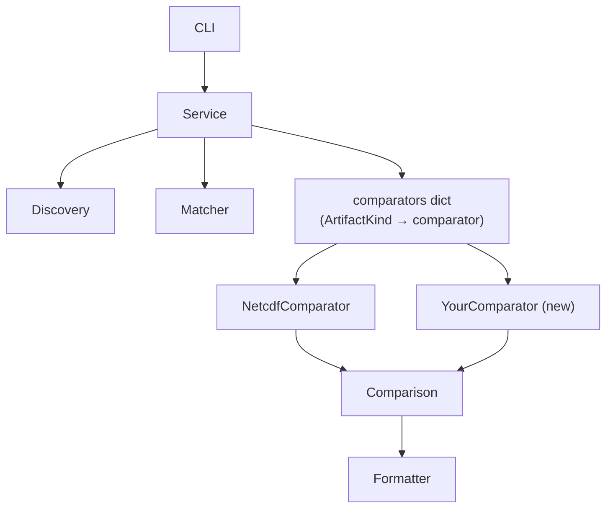

# Adding a Custom Comparator

`xdiff` uses a comparator registry pattern that makes it straightforward to support new artifact types. The service never hard-codes comparator logic — it dispatches by `ArtifactKind` at runtime, so adding a new type is fully additive: you create new files and touch two existing ones.

## Architecture



Discovery finds artifacts on disk, Matcher pairs them across the two roots, and the Service dispatches each matched pair to the right comparator based on its kind. The Formatter and progress reporter consume `Comparison` / `CompareResult` objects — they are fully generic and never need to change.

Error cases (no match found, kind mismatch between the pair, no comparator registered) are handled centrally by `compare_match()` in `service.py`. Your comparator only needs to handle the happy path.

## Four Touch Points

### 1 Add an ArtifactKind value — xdiff/model/artifact.py

```python
class ArtifactKind(str, Enum):
    NETCDF   = "netcdf"
    TEXT     = "text"
    NAMELIST = "namelist"
    ZARR     = "zarr"    # ← add yours here
    UNKNOWN  = "unknown"
```

### 2. Teach `infer_artifact_kind()` to recognise it — same file

```python
def infer_artifact_kind(path: Path) -> ArtifactKind:
    suffix = path.suffix.lower()
    if suffix == ".nc":
        return ArtifactKind.NETCDF
    if suffix == ".zarr":
        return ArtifactKind.ZARR     # ← add your rule
    ...
```

`FileSystemArtifactDiscovery` calls this automatically for every discovered path, so no other discovery code needs to change.

### 3. Create `xdiff/comparators/<type>.py`

Implement the single-method `ArtifactComparator` ABC:

```python
from __future__ import annotations

from xdiff.comparators.base import ArtifactComparator
from xdiff.model.artifact import ArtifactKind
from xdiff.model.compare_result import CompareResult
from xdiff.model.comparison import Comparison
from xdiff.model.match import ArtifactMatch
from xdiff.model.request import CompareRequest


class ZarrComparator(ArtifactComparator):
    artifact_kind = ArtifactKind.ZARR

    def compare(self, match: ArtifactMatch, request: CompareRequest) -> Comparison:
        comparison = Comparison(
            reference_artifact=match.reference,
            comparison_artifact=match.comparison,
        )
        # Run your comparison logic and append one CompareResult per variable/check.
        # CompareResult fields: variable, relative_error, min_diff, max_diff,
        #                       mask_equal, description (optional failure note)
        comparison.append(
            CompareResult(
                variable="my_var",
                relative_error=0.0,
                min_diff=0.0,
                max_diff=0.0,
                mask_equal=True,
            )
        )
        return comparison
```

A `CompareResult` is considered **passed** when `relative_error == 0` and `description` is empty. Set `description` to a non-empty string to mark it as failed with an explanation.

### 4. Register in `xdiff/core/service.py`

```python
def load_default_comparators():
    from xdiff.comparators import NetcdfComparator
    from xdiff.comparators.zarr import ZarrComparator  # ← import yours

    return [NetcdfComparator(), ZarrComparator()]       # ← add to list
```

That's it. The CLI, formatter, progress reporter, and summary table all work without any further changes.

## Kinds Without a Comparator Yet

The `ArtifactKind` enum already defines `TEXT` and `NAMELIST`, and `infer_artifact_kind()` already maps common extensions to them (`.txt`, `.cfg`, `.conf`, `.def`, `.xml` → `TEXT`; filenames starting with `namelist` → `NAMELIST`). They are natural starting points if you want a low-friction first implementation — steps 1 and 2 above are already done for you.

## Testing

Add a test file under `tests/test_<type>_comparator.py`. A minimal smoke test covers the three meaningful outcomes your comparator should handle:

- two identical artifacts → all results pass
- two differing artifacts → at least one result fails with a non-zero error metric
- a missing comparison artifact → the service produces a `NoMatchFound` error (this is handled upstream, but it is worth asserting via the service layer)

Run the full suite before opening a PR:

```shell
uv run pytest --cov --cov-report=term-missing
```
